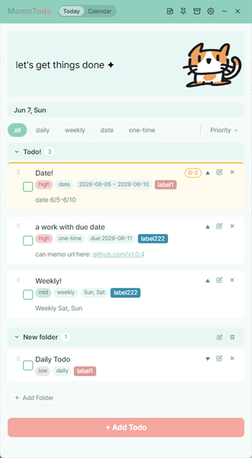
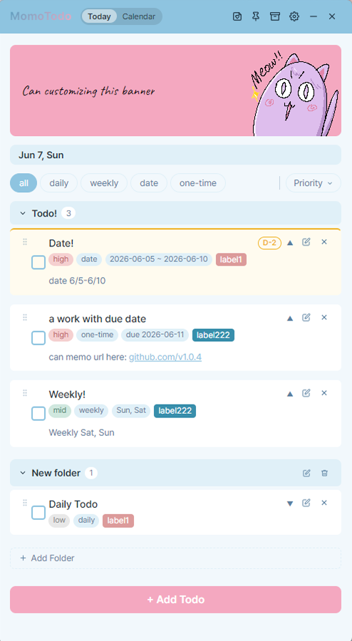
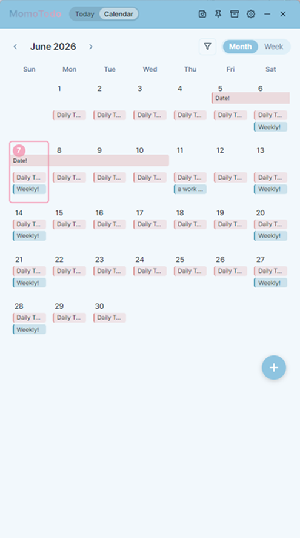
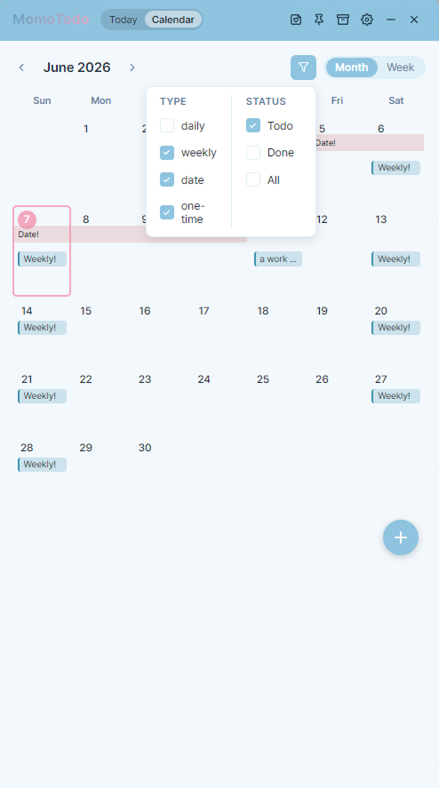
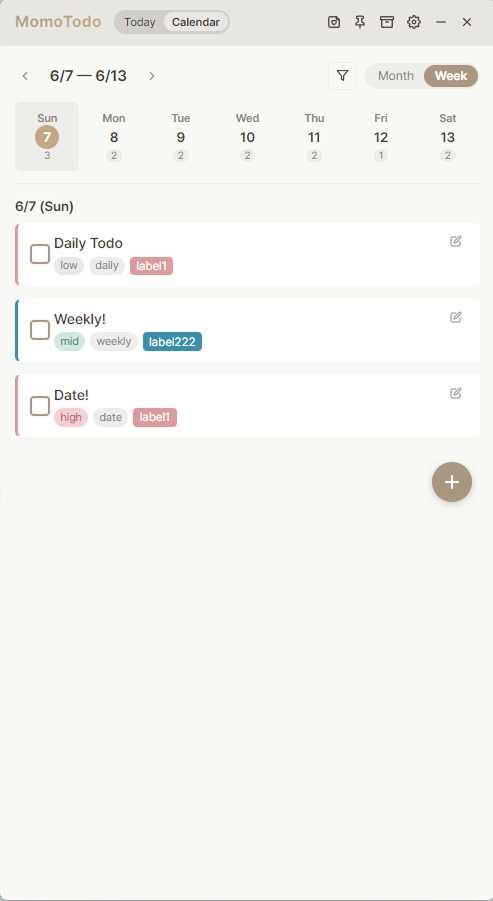
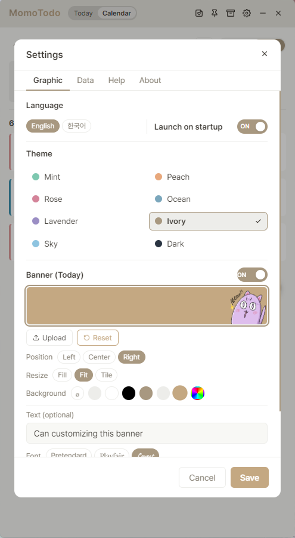

# MomoTodo

A personal desktop todo app built with Electron + React.  
Your data stays local — no accounts, no subscriptions, no cost.

Electron + React로 만든 개인용 데스크탑 투두 앱입니다.  
모든 데이터는 사용자의 컴퓨터에만 저장됩니다 — 계정 없음, 구독 없음, 무료.

---

## Download

[Latest Release](https://github.com/SooaMo/momo-todo/releases/latest)

Windows: `MomoTodo-x.x.x-windows-setup.exe`  

> Please download the installer file above, not the source code zip.  
> Source code zip 파일이 아닌 위의 설치 파일을 다운받아 설치해주세요.

---

## Screenshots

  
  

  
  

  
  

---

## Features

- **Todo types** — Daily, Weekly, Date range, One-time
- **Priority** — High, Mid, Low with urgency indicators
- **Labels** — Custom text & color tags
- **Memo** — Add notes, double-click to edit inline
- **Folders** — Organize todos into folders with drag & drop
- **Calendar** — Month & Week views with type/status filter
- **Stickers** — Drag & drop image stickers on any page
- **Archive** — Soft delete with restore
- **Themes** — Mint, Peach, Rose, Ocean, Lavender, Ivory, Sky, Dark
- **Banner** — Customize the top banner with image & text
- **Always on Top** — Keep the app floating above other windows
- **Local only** — All data saved on your computer

---

## Built With

- [Electron](https://www.electronjs.org/)
- [React](https://react.dev/)
- [Vite](https://vitejs.dev/)
- [electron-store](https://github.com/sindresorhus/electron-store)
- [@dnd-kit](https://dndkit.com/)

---

Made with claude by Momo
